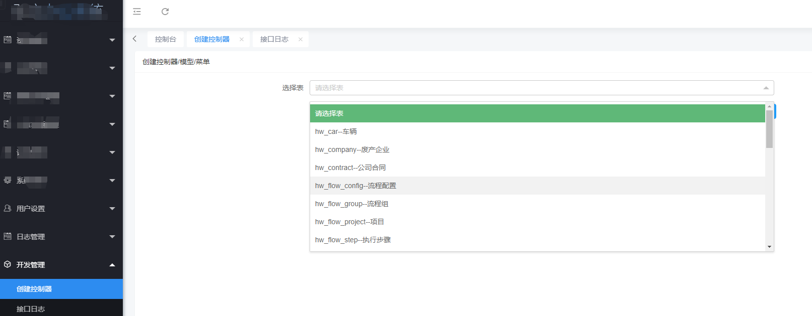
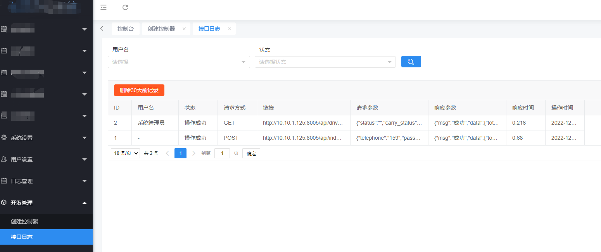

## 旧项目添加扩展
### 一、安装
`composer require fearless/think-tool`
### 二、后台创建控制器、接口日志菜单、插件模块
`php think hw:cover`或 `php think hw:dl`

#### 创建控制器

#### 接口日志

## 其他命令
#### 创建模型和后台控制器（存在文件不创建）
`php think hw:mc sys_user`
#### 更新菜单（seed配置及控制器menu配置）
`php think hw:um`
#### 安装activity插件
`php think hw:install activity`
